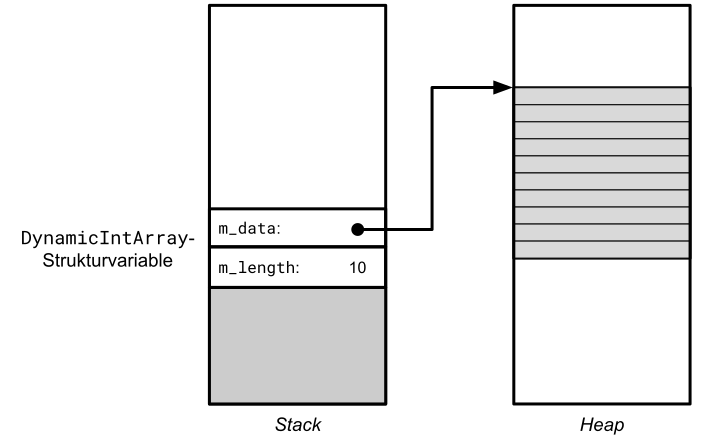
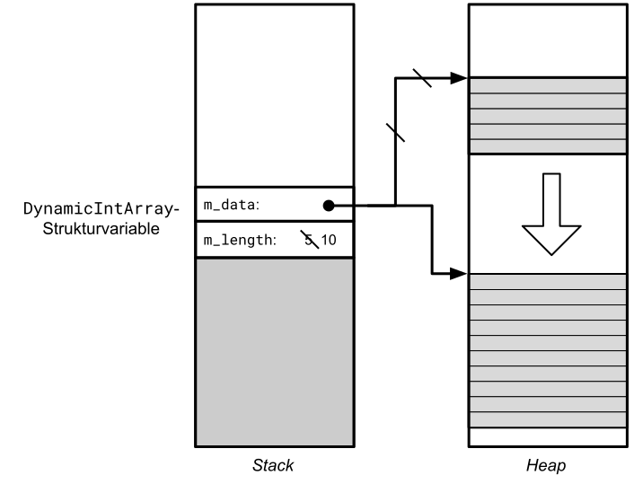
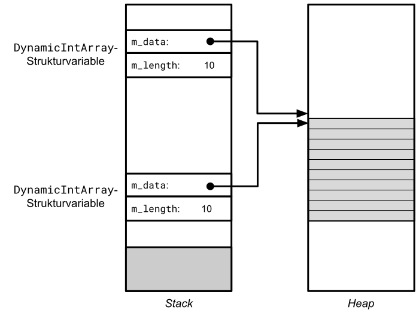
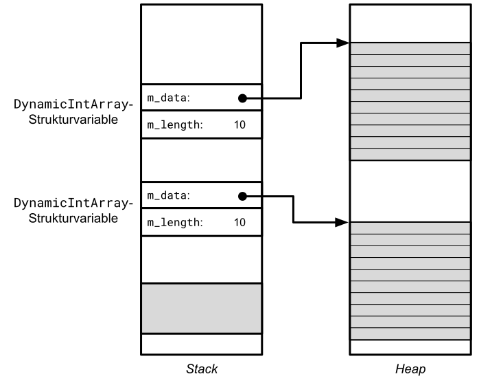

# Struktur `DynamicIntArray`

[Zurück](./../Exercises.md)

---

## Übersicht

Der Datentyp *Array* steht in C für Felder **fester** Länge.
Es gibt keinerlei Möglichkeit, nach dem Erzeugen eines Felds seine Länge zu ändern.

```c
int numbers[10];
```

Der Wert 10 muss zur Übersetzungszeit bekannt sein &ndash; und ist nicht veränderbar.

An dieser Stelle kommt die dynamische Speicherverwaltung ins Spiel:
Mit Hilfe der beiden Funktionen `malloc` (bzw. `calloc`) und `free` kann man eine Struktur `DynamicIntArray` realisieren,
die im Prinzip dieselbe Funktionalität wie ein C&ndash;Feld besitzt,
nur mit dem Unterschied, dass die Längenangabe sowohl zum Erzeugungszeitpunkt
als auch während der Lebenszeit der `DynamicIntArray`-Strukturvariablen änderbar ist.

Diese Flexibilität wird dadurch erreicht, dass man die Daten des Felds in einem Speicherbereich auf der Halde (*Heap*) ablegt.
Bei Bedarf, zum Beispiel, wenn der Datenbereich zu klein geworden ist, kann man auf der Halde ein größeres Stück Speicher reservieren.

Implementieren Sie eine Struktur `DynamicIntArray`, die diese Eigenschaft besitzt.
Eine Variable dieses Typs sollte wie in *Abbildung* 1 gezeigt aussehen:



*Abbildung* 1. Datenbereich einer `DynamicIntArray`-Strukturvariablen mit dynamisch allokiertem Datenpuffer.

Wir erkennen in *Abbildung* 1 zwei Variablen in der Struktur `DynamicIntArray`: `m_data` und `m_length`.
`m_data` enthält die Adresse eines Stück Speichers, das sich auf der Halde befindet und mit der `malloc`-Funktion angelegt wurde.
Die Länge dieses Speicherbereichs wird in der zweiten Instanzvariablen `m_length` festgehalten.

Die Problematik, wenn der dynamisch allokierte Datenpuffer zu klein wird, haben wir bereits angesprochen.
*Abbildung* 2 soll veranschaulichen, wie wir mit einem neuen Datenpuffer größere Anforderungen erfüllen können.
Neben einem größeren Stück Speicher, das wieder mit der `malloc`-Funktion angelegt wird, ist zu beachten, dass der
vorhandene Inhalt des alten Speicherbereichs in den neuen umzukopieren ist.



*Abbildung* 2. Vergrößerung des Datenbereichs einer `DynamicIntArray`-Strukturvariablen.


In *Abbildung* 3 und *Abbildung* 4 sprechen wir ein letztes Problem in der Realisierung der `DynamicIntArray`-Struktur an:
Die Wertzuweisung zweier `DynamicIntArray`-Strukturvariablen. In einem ersten Ansatz könnte man geneigt sein zu denken,
dass diese einfach mit dem Kopieren zweier Strukturvariablen umzusetzen ist.

*Abbildung* 3 versucht darzustellen, dass dies nicht zu einer Realisierung führt, die man als korrekt ansehen kann:
Die beiden in *Abbildung* 3 dargestellten `DynamicIntArray`-Strukturvariablen haben einen gemeinsamen Datenbereich auf Grund des kopierten Zeigers.
Dies ist nicht das, was man sich unter einer echte Kopie vorstellt.



*Abbildung* 3. Falscher Ansatz beim Kopieren einer `DynamicIntArray`-Strukturvariablen.

*Abbildung* 4 veranschaulicht, wie hier korrekt vorzugehen ist:
Eine Kopie einer `DynamicIntArray`-Strukturvariablen muss einen neuen, separaten Datenbereich erhalten:



*Abbildung* 4. Korrekter Ansatz beim Kopieren einer `DynamicIntArray`-Strukturvariablen.

Zu diesem Zweck finden Sie in *Tabelle* 1 eine Funktion `createDynamicIntArrayFromDynamicIntArray` vor,
die den Vorgang von *Abbildung* 4 implementiert.


Realisieren Sie folgende C-Funktionen, die mit der Struktur `DynamicIntArray` zusammenarbeiten:

| Funktion  | Schnittstelle und Beschreibung |
|:--------- |--------------------------------|
| `initDynamicIntArray` | `int initDynamicIntArray(struct DynamicIntArray* array, size_t length);`<br /> Initialisiert eine `DynamicIntArray`-Strukturvariable mit einem Datenpuffer der Länge `length`. |
| `releaseDynamicIntArray` | `void releaseDynamicIntArray(struct DynamicIntArray* array);`<br /> Gibt den dynamisch allokierten Speicher wieder frei. |
| `createDynamicIntArrayFromArray` | `void createDynamicIntArrayFromArray(struct DynamicIntArray* array, int* values, int length);`<br /> Übernimmt die Daten eines C-Arrays (Parameter `values` und `length`) in eine `DynamicIntArray`-Strukturvariable. |
| `createDynamicIntArrayFromDynamicIntArray` | `void createDynamicIntArrayFromDynamicIntArray(struct DynamicIntArray* array, struct DynamicIntArray* other);`<br /> Legt eine Kopie einer vorhandenen `DynamicIntArray`-Strukturvariablen (`other`) an. |
| `fillDynamicIntArray` | `void fillDynamicIntArray(struct DynamicIntArray* array, int value);`<br /> Belegt alle Elemente des Datenpuffers einer `DynamicIntArray`-Strukturvariablen `array` mit dem Wert `value`. |
| `getLength` | `size_t getLength(struct DynamicIntArray* array);`<br /> Liefert die Länge einer `DynamicIntArray`-Strukturvariablen `array` zurück. |
| `get` | `int get(struct DynamicIntArray* array, int index);`<br /> Liefert das Element an der Stelle *i* zurück. Bei ungültigem Index wird -1 zurückgegeben. |
| `set` | `void set(struct DynamicIntArray* array, int index, int value);`<br /> Setzt das Element an der Stelle *i* auf einen neuen Wert `value`. |
| `resizeDynamicIntArray` | `int resizeDynamicIntArray(struct DynamicIntArray* array, int newLength);`<br /> Ändert die Länge des internen Datenpuffers auf den neuen Wert `newLength`. Die vorhandenen Daten im Puffer sollen dabei &ndash; soweit möglich &ndash; erhalten bleiben, sprich: Ist die neue Länge kürzer im Vergleich zur aktuellen Länge, spielen die Daten im oberen Teil des alten Puffers keine Rolle mehr. Ist die neue Länge jedoch größer, ist der aktuelle Puffer komplett umzukopieren und die zusätzlichen Elemente im oberen Bereich sind mit `0` vorzubelegen. |
| `shrinkToFitDynamicIntArray` | `int shrinkToFitDynamicIntArray(struct DynamicIntArray* array);`<br /> Sollte auf Grund eines oder mehrerer `resizeDynamicIntArray`-Aufrufe der Datenpuffer größer als erforderlich sein, wird ein neuer Datenpuffer mit exakt passender Länge angelegt. Natürlich sind die vorhandenen Elemente des alten Puffers umzukopieren. |
| `minimum` | `int minimum(struct DynamicIntArray* array);`<br /> Liefert das minimale Element im Datenpuffer zurück. |
| `maximum` | `int maximum(struct DynamicIntArray* array);`<br /> Liefert das maximale Element im Datenpuffer zurück.  |
| `indexOf` | `int indexOf(struct DynamicIntArray* array, int value);`<br /> Liefert die Position des gesuchten Elements `value` im Datenpuffer zurück. Ist das Element nicht vorhanden, wird -1 zurückgegeben. |
| `equalsDynamicIntArray` | `int equalsDynamicIntArray(struct DynamicIntArray* array, struct DynamicIntArray* other);`<br /> Vergleicht zwei `DynamicIntArray`-Strukturvariablen `array` und `other` auf Gleichheit. |
| `containsDynamicIntArray` | `int containsDynamicIntArray(struct DynamicIntArray* array, int value);`<br /> Liefert 0 oder 1 zurück, je nach dem, ob das Element `value` vorhanden ist oder nicht.|
| `printDynamicIntArray` | `void printDynamicIntArray(struct DynamicIntArray* array);`<br /> Gibt alle Elemente des Datenpuffers in der Konsole aus. |

*Tabelle* 1: Funktionen, die mit der Struktur `DynamicIntArray` zusammenarbeiten.

---

## Quellcode der Lösung

[*DynamicIntArray.h*](./DynamicIntArray.h)<br />
[*DynamicIntArray.c*](./DynamicIntArray.c)<br />

---

[Zurück](./../Exercises.md)

---


