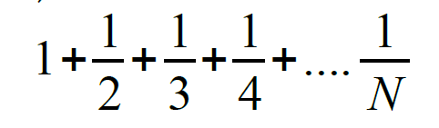
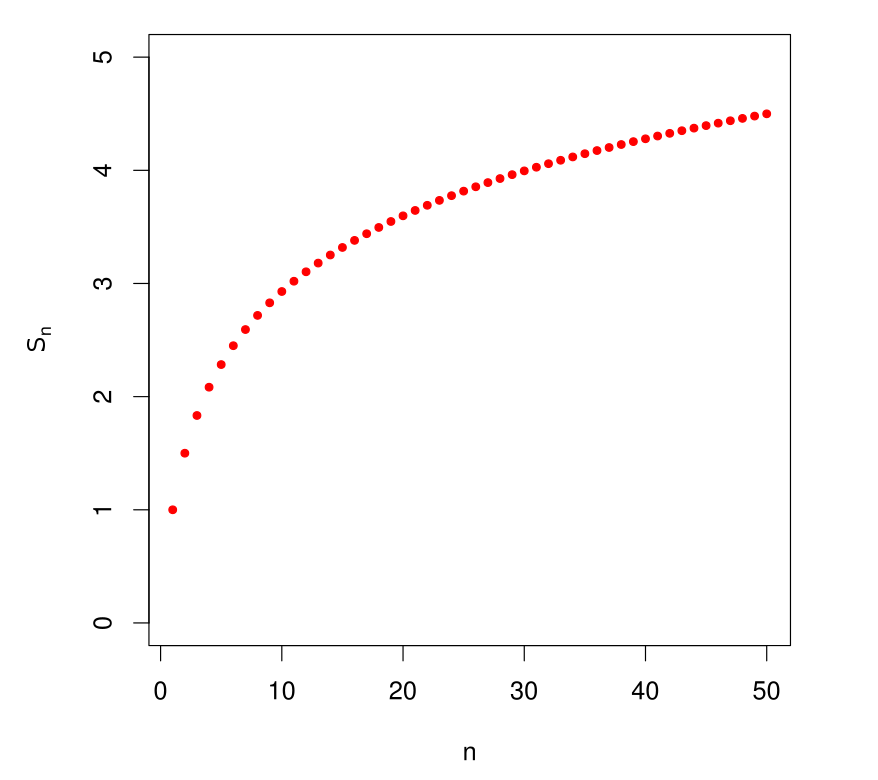

# Harmonische Reihe

[Zurück](./../Exercises.md)

---

## Übersicht

Schreiben Sie ein Programm, welches die Folgenglieder der harmonischen Reihe

1 + 1/2 + 1/3 + 1/4 + 1/5 + … + 1/*N*

zusammenzählt.

Lösen Sie die Aufgabe sowohl mit einer `for()`- als auch mit einer `while()`-Wiederholungsanweisung.

Testen Sie Ihre Realisierung mit unterschiedlichen Werten für *N*:

*Abbildung* 1: Reihenentwicklung der harmonischen Reihe.

Die Berechnung der harmonischen Reihe ist in einer Funktion vorzunehmen.
Das Ergebnis der Berechnung ist durch einen geeigneten Rücgabetyp zurückzuliefern.

Untersuchen Sie, was für große Werte von *N* geschieht.

Überprüfen Sie die Richtigkeit Ihrer Realisierung mit folgendem Bild.

*Abbildung* 2: Die harmonische Reihe konvergiert nicht.

---

## Quellcode der Lösung

[*Wahl.c*](./HarmonischeReihe.c)

---

[Zurück](./../Exercises.md)

---
