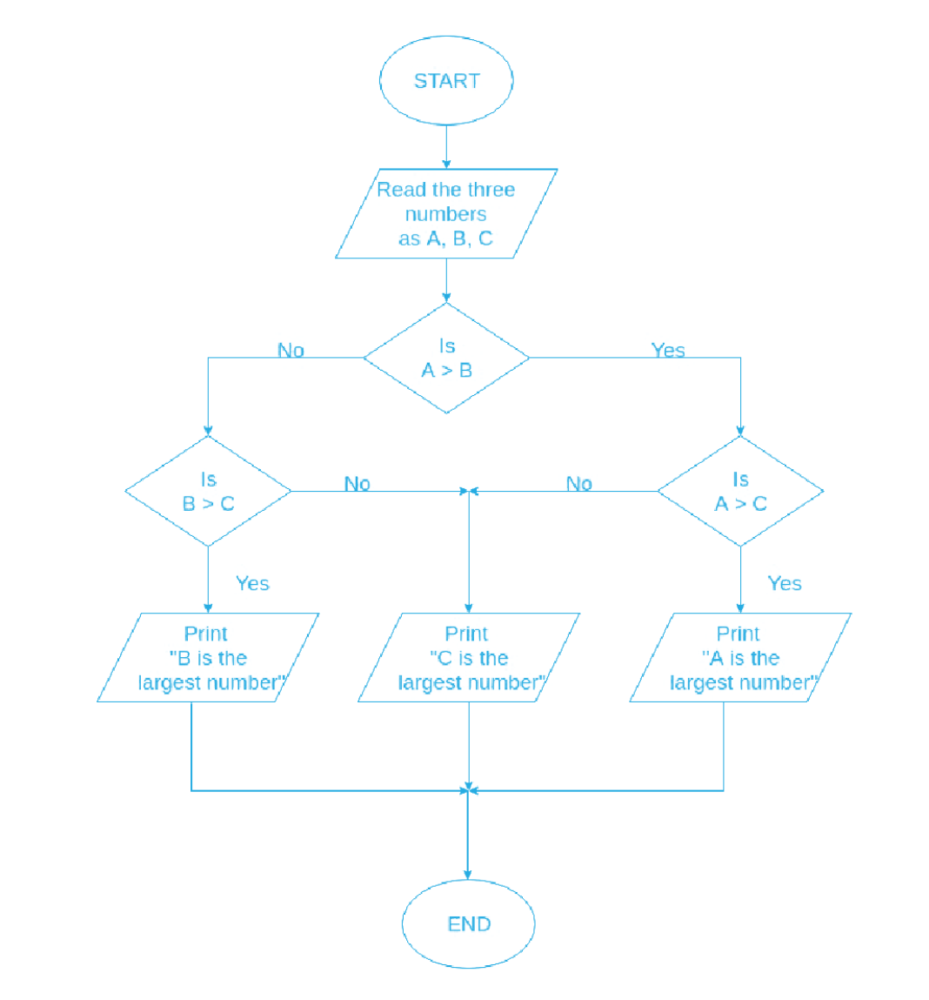

# Maximum von drei Zahlen

[Zurück](./../Exercises.md)

---

## Einführung

Schreibe eine Funktion, die zu drei Zahlen die größte Zahl ermittelt und auf der Konsole ausgibt.

Natürlich kommen hier `if`-Anweisungen ins Spiel,
es gibt aber durchaus mehrere Möglichkeiten, das Ziel zu erreichen.

Wenn es für Sie einfacher ist:
Pseudogramme, oder auch Struktogramme, sind eine grafische Option,
um von der Konzeption zu einer Umsetzung in C-Quellcode zu gelangen:

*Abbildung* 1: Struktogramm zur Berechnung des Maximums dreier Zahlen.

---

## Quellcode der Lösung:

[*Maximum.c*](./Maximum.c) 

---

[Zurück](./../Exercises.md)

---
