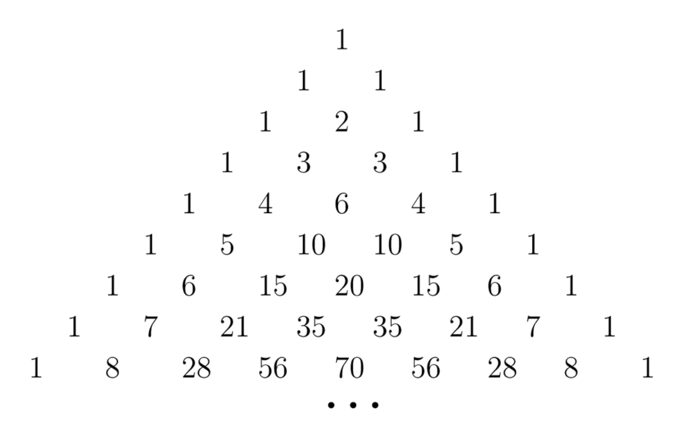

# Aufgabe zum Pascal’schen Dreieck

[Zurück](./../Exercises.md)

---

## Übersicht

Das *Pascal’sche Dreieck* ist eine Form der grafischen Darstellung der Binomialkoeffizienten $ \binom{n}{k} $.

Die Koeffizienten sind im Dreieck so angeordnet,
dass jeder Eintrag die Summe der zwei darüberstehenden Einträge ist.
Damit lässt sich eine Berechnung auch recht einfach durchführen.

Mathematisch könnte man diese Beobachtung auch auf der Gleichung

$$ \binom{n+1}{k+1}  = \binom{n}{k} + \binom{n}{k+1} $$

ableiten.  Die Variable *n* kann man als Zeilenindex und *k* als Spaltenindex interpretieren.
Die Zählung beginnt mit Null, also erste Zeile *n* = 0, erste Spalte *k* = 0.
Beginnt man an den Rändern mit dem Wert 1, so ergeben sich auf diese Weise genau die Binomialkoeffizienten:

PascalTriangle_01.png

*Abbildung* 1. Das *Pascal’sche Dreieck* und Binomialkoeffizienten.

*Abbildung* 2. Das *Pascal’sche Dreieck* mit realen Werten.

Der Name des Dreiecks geht auf *Blaise Pascal* zurück.

## Aufgabe

Schreiben Sie zwei Funktionen `createPascalTriangle` und  `printPascalTriangle`,
die ein *Pascal’sche Dreieck* berechnen und in der Konsole ausgeben.

Beide Funktionen haben einen ganzzahligen Wert als Parameter, der die Anzahl der Zeilen festlegt.

Verwenden Sie in der Realisierung ein zwei-dimensionales Feld in C.

## REST

$$\left( ^{N-k} {a-n} \right)$$

$$\left( \binom{n}{k}  \right)$$

$$ \binom{n}{k} $$

---

## Quellcode der Lösung

[*Fakultaet.c*](./PascalTriangle.c)

---

[Zurück](./../Exercises.md)

---
