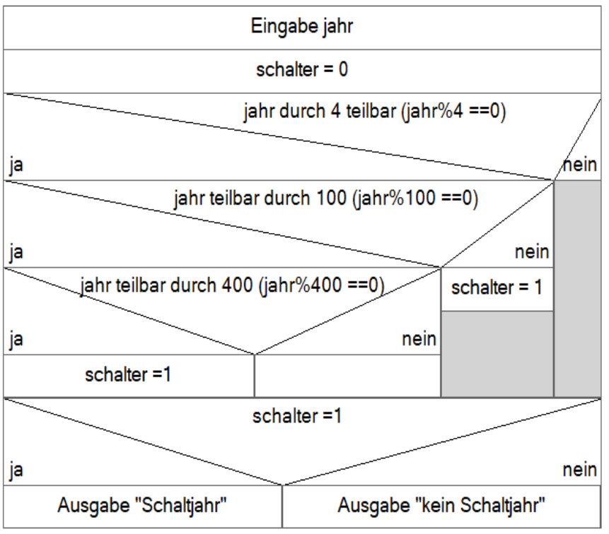

# Aufgaben zu Funktionen: Kreisfläche, Zinsrechnung und Schaltjahr

[Zurück](./../Exercises.md)

---

## Übersicht

### Fläche eines Kreises

Schreiben Sie eine Funktion `areaCircle`, die die Fläche eines Kreises berechnet.
Der Radius des Kreises ist von der Konsole einzulesen und an das Unterprogramm zu übergeben.
Das Ergebnis ist als Rückgabewert von dem Unterprogramm zurückzuliefern
und wiederum im Hauptprogramm auszugeben.

### Zinsrechnung

Schreiben Sie eine Funktion `doubleInterestRate`, das in zwei Parametern ein Startkapital und einen Zinssatz (pro Jahr) entgegennimmt.

Als Rückgabewert liefert die Funktion einen ganzzahligen Wert zurück, der beschreibt,
nach wie vielen Jahren das eingesetzte Kapital sich verdoppelt hat.

### Schaltjahr

Entwickeln Sie ein Unterprogramm `isLeapYear`, welches von einem gegebenen Jahr ermittelt, ob dieses ein Schaltjahr ist oder nicht.

*Eingabe*:
Beliebiges Jahr *N* ab 1800.

*Ausgabe*:
*N* ist Schaltjahr oder *N* ist kein Schaltjahr.

*Hilfestellung*:

Es gibt drei Regeln, die Sie zur Berechnung eines Schaltjahres benötigen:

  * Regel 1: Schaltjahre sind durch 4 teilbar.
  * Regel 2: Ist das Jahr durch 100 teilbar, dann ist es kein Schaltjahr.
  * Regel 3: Ist das Jahr durch 400 teilbar, dann ist es trotzdem ein Schaltjahr.

Auch hier kann bei bei der Realisierung die Betrachtung eines Struktogramms hilfreich sein:

*Abbildung* 1: Struktogramm zur Berechnung der Schaltjahr-Eigenschaft eines vorgegebenen Jahrs.

---

## Quellcode der Lösung

[*Unterprogramme.c*](./Unterprogramme.c) 

---

[Zurück](./../Exercises.md)

---
