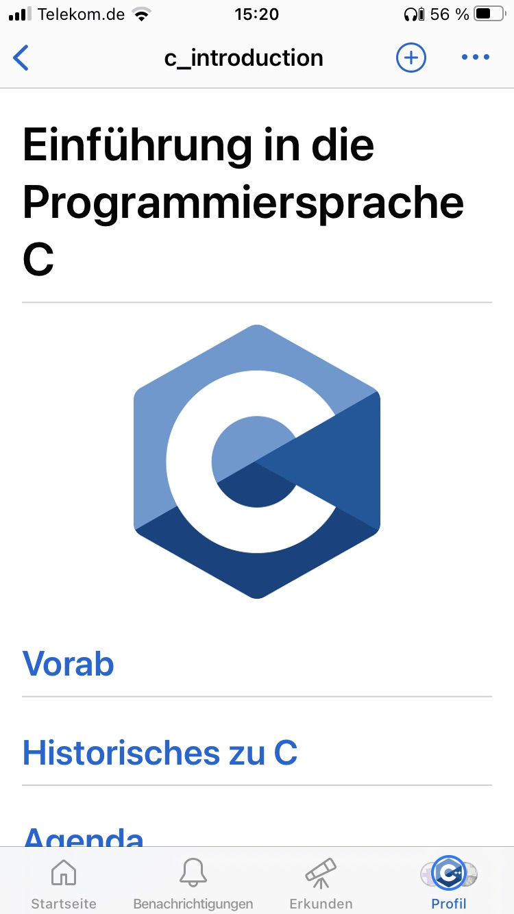
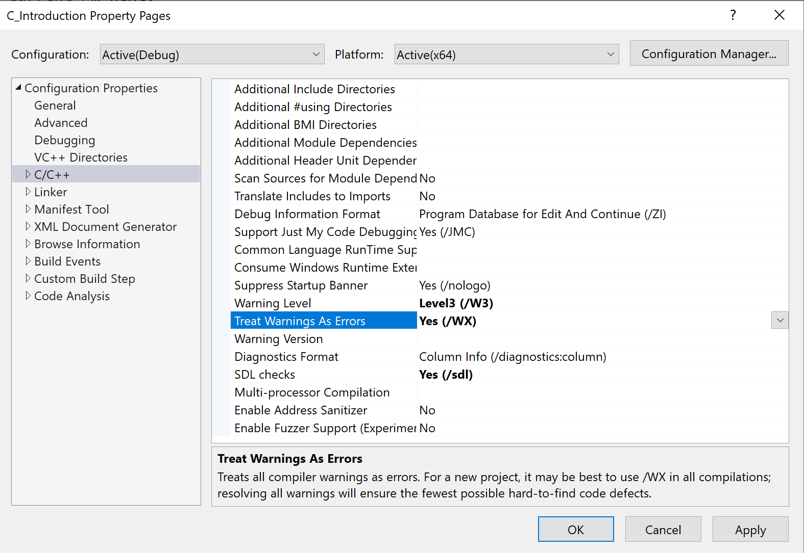

# Technische Hinweise

[Zurück](../../Readme.md)

---

## Compiler / Entwicklungsumgebung

Das Repository wurde mit der &bdquo;*Visual Studio*&rdquo; Entwicklungsumgebung 2022 erstellt.
Alle Beispiel müssten aber auch mit dem GCC Compiler übersetzungsfähig sein.

---

## GitHub Mobile

GitHub-Repositories können auf mobilen Devices (IOS, Android) auch mit der jeweiligen
*GitHub Mobile App* betrachten werden:

&nbsp;&nbsp;&nbsp;&nbsp;&nbsp;&nbsp;&nbsp;&nbsp;&nbsp;&nbsp;&nbsp;&nbsp;&nbsp;&nbsp;&nbsp;

*Abbildung* 1: Ausschnitt des Repositories auf einem iPhone.

Und hier zum Vergleich auf einem iPad:

&nbsp;&nbsp;&nbsp;&nbsp;&nbsp;

*Abbildung* 2: Ausschnitt des Repositories auf einem iPad.

---

## C Compiler Option *TreatWarningsAsErrors*

Die Compiler Option *TreatWarningsAsErrors* behandelt bei der Übersetzung eines Programms
alle Warnungen als Fehler.

Diese Option ist aus meiner Sicht mehr als empfehlenswert, da einige &bdquo;Warnings&rdquo; in C
beim besten Willen keinen Hinweis darstellen, sondern einen Fehler beschreiben.

In den Eigenschaften eines C-Projekts kann man diese Option unter 

Diese Einstellung findet man unter dem Pfad

*Properties -> C/C++ -> General -> Treat Warnings As Errors*

festlegen, siehe dazu auch *Abbildung* 3:

*Abbildung* 3: Einstellungen eines Visual Studio Projekts.

---

[Zurück](../../Readme.md)

---
