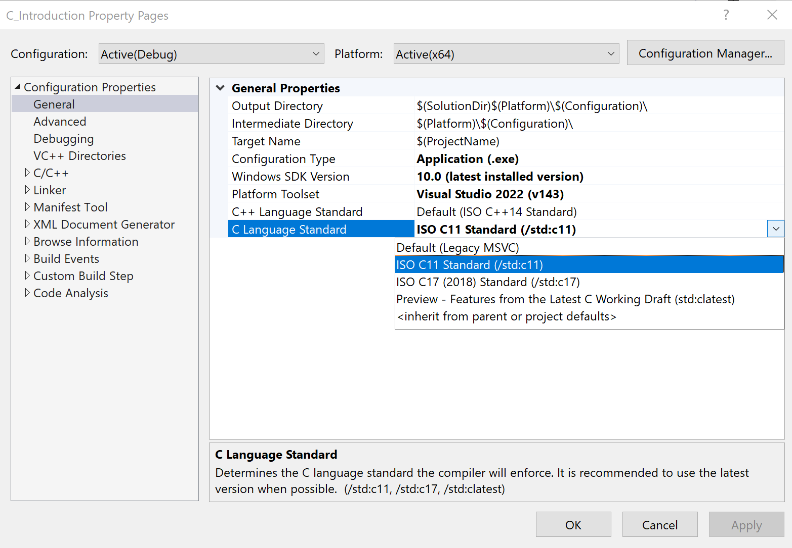

# Technische Hinweise

[Zurück](../../Readme.md)

---

## Compiler / Entwicklungsumgebung

Das Repository wurde mit der &bdquo;*Visual Studio*&rdquo; Entwicklungsumgebung 2022 erstellt.
Alle Beispiel müssten aber auch mit dem GCC Compiler übersetzungsfähig sein.

---

## C-Versionen

Es gibt von der Programmiersprache C mehrere, historisch bedingte Versionen:

  * *K&R* Standard &ndash; Definition von C nach *Brian Kernighan* und *Dennis Ritchie*.
  * *ANSI C89* &ndash; Übergabe der Definition von C an das *American National Standard Institute*.
  * *ISO C99* &ndash; Weiterentwicklung der bisherigen Versionen.
  * *C 11* &ndash; Weiterentwicklung der bisherigen Versionen durch das *ISO* Gremium.

Die Beispiele dieses Repositories versuchen soweit wie möglich, spezielle Eigenheiten
einer bestimmten Sprachversion zu vermeiden. Das letzte Kapitel &bdquo;Einige fortgeschrittene Themen&rdquo;
benötigt unter Visual Studio die Einstellung *ISO C11 Standard*.

---

## GitHub Mobile

GitHub-Repositories können auf mobilen Devices (IOS, Android) auch mit der jeweiligen
*GitHub Mobile App* betrachten werden:

&nbsp;&nbsp;&nbsp;&nbsp;&nbsp;&nbsp;&nbsp;&nbsp;&nbsp;&nbsp;&nbsp;&nbsp;&nbsp;&nbsp;&nbsp;

*Abbildung* 1: Ausschnitt des Repositories auf einem iPhone.

Und hier zum Vergleich auf einem iPad:

&nbsp;&nbsp;&nbsp;&nbsp;&nbsp;

*Abbildung* 2: Ausschnitt des Repositories auf einem iPad.

---

## C Compiler Option *TreatWarningsAsErrors*

Die Compiler Option *TreatWarningsAsErrors* behandelt bei der Übersetzung eines Programms
alle Warnungen als Fehler.

Diese Option ist aus meiner Sicht mehr als empfehlenswert, da es sich bei vielen &bdquo;*Warnings*&rdquo; in C
schlicht und ergreifend um Fehler handelt!
In den Eigenschaften eines C-Projekts kann man diese Option unter 

*Properties -> C/C++ -> General -> Treat Warnings As Errors*

festlegen, siehe dazu auch *Abbildung* 3:

*Abbildung* 3: Einstellungen eines Visual Studio Projekts.

---

[Zurück](../../Readme.md)

---
