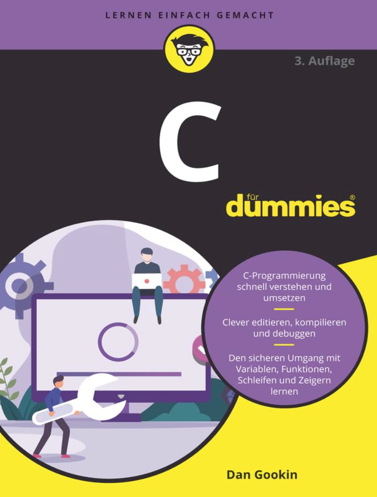
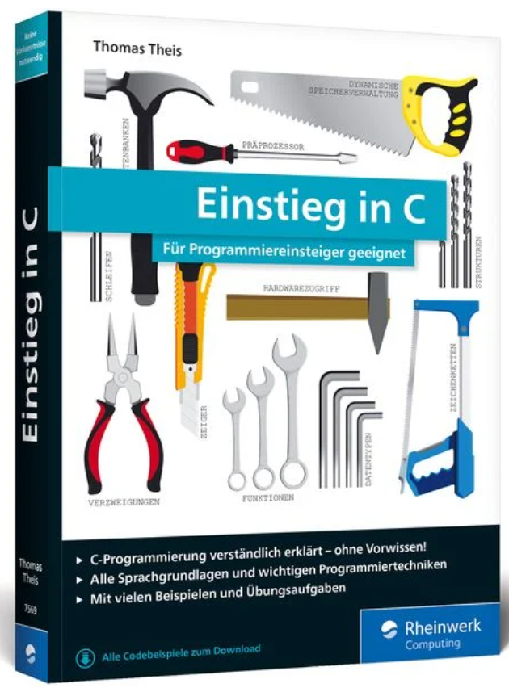
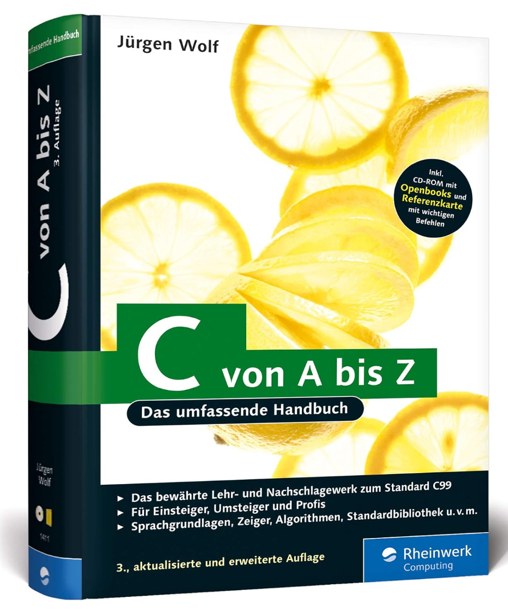

# Literatur

[Zurück](../../Readme.md)

---

## C

  * Dan Gokin, &bdquo;*C für Dummies*&rdquo;. 
    Wiley-VCH (7. April 2021), 640 Seiten. Sprache: Deutsch. ISBN-13: 978-3527718450.

    

---

  * Thomas Theis, &bdquo;*Einstieg in C: Für Programmiereinsteiger geeignet.*&rdquo;. 
    Rheinwerk Computing (28. März 2020), 436 Seiten. Sprache: Deutsch. ISBN-13: 978-3836275699.

    

---

  * Dirk Louis, &bdquo;*C++ &ndash; Das komplette Starterkit für den einfachen Einstieg in die Programmierung*&rdquo;. 
    Hanser Fachbuch (9. April 2018), 490 Seiten. Sprache: Deutsch. ISBN-13: 978-3446445970, ISBN-10: 3446445978.
   

    

---

## C Online Tutorial

  * [*Rheinwerk &ndash; &bdquo;C von A bis Z &ndash; Das umfassende Handbuch&rdquo;* (Jürgen Wolf)](https://openbook.rheinwerk-verlag.de/c_von_a_bis_z/index.htm)
  
    oder in Buchform

  * Rheinwerk Computing (3. Auflage, 25. September 2009), 1190 Seiten. Sprache: Deutsch. ISBN-13: 978-3836214117, ISBN-10: 3836214113.
   
     

---

[Zurück](../../Readme.md)

---
