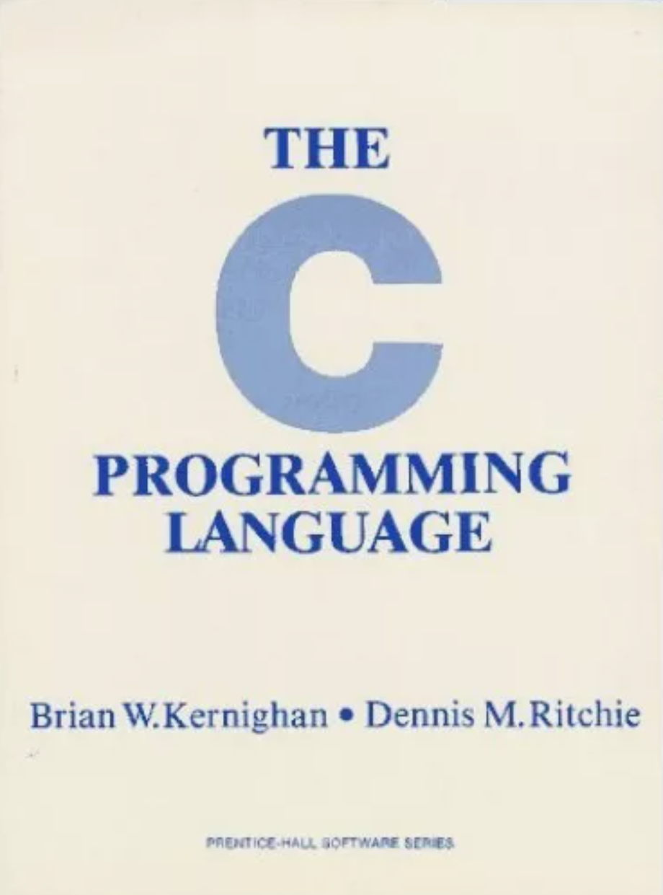
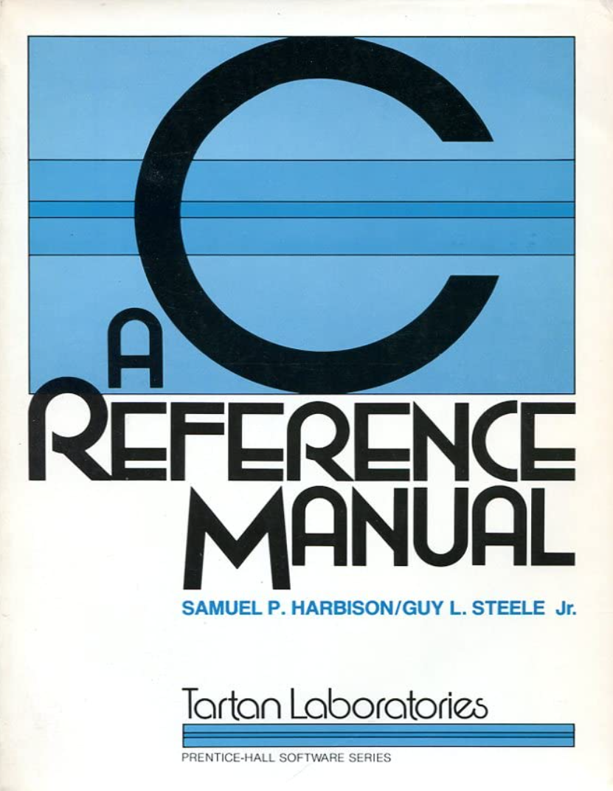
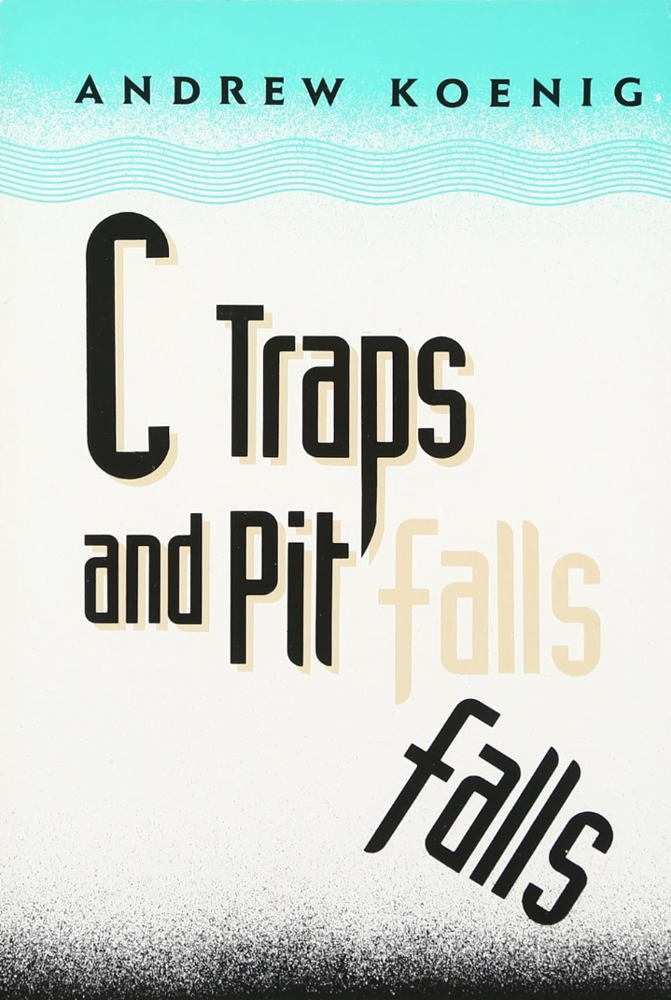

# Literatur

[Zurück](../../Readme.md)

---

## Drei ultimative Klassiker

  * Brian W. Kernighan, Dennis M. Ritchie &bdquo;*The C Programming Language*&rdquo;. 
    Prentice Hall (1. Mai 1983), 228 Seiten. Sprache: Englisch. ISBN-13: 9978-0131101630, ISBN-10: 0131101633.

    

  * Dennis M. Ritchie &bdquo;*C Reference Manual*&rdquo;. 
    Bell Telephone Laboratories, Murray Hill, New Jersey 07974.

    Hierbei handelt es sich nicht um ein Buch, sondern ein [Pdf-Dokument](cman.pdf).

  * Samuel P. Harbison, Guy L. Steele &bdquo;*TC: A Reference Manual*&rdquo;. 
    Prentice Hall (1. November 1984), 352 Seiten. Sprache: Englisch. ISBN-13: 978-0131100084, ISBN-10: 0131100084.

    

    Dieses Buch ist in einer Reihe von Auflagen erschienen,
    die jüngste Auflage findet man [hier](harbison_steelec_a_reference_manual_5th_ed.pdf).

---

## Weitere Bücher

  * Dan Gokin, &bdquo;*C für Dummies*&rdquo;. 
    Wiley-VCH (7. April 2021), 640 Seiten. Sprache: Deutsch. ISBN-13: 978-3527718450, ISBN-10: 3527718451.

    

---

  * Thomas Theis, &bdquo;*Einstieg in C: Für Programmiereinsteiger geeignet.*&rdquo;. 
    Rheinwerk Computing (28. März 2020), 436 Seiten. Sprache: Deutsch. ISBN-13: 978-3836275699, ISBN-10: 3836275694.

    

---

  * Dirk Louis, &bdquo;*C++ &ndash; Das komplette Starterkit für den einfachen Einstieg in die Programmierung*&rdquo;. 
    Hanser Fachbuch (9. April 2018), 490 Seiten. Sprache: Deutsch. ISBN-13: 978-3446445970, ISBN-10: 3446445978.
   

    

---

  * Andrew Koenig, &bdquo;*C Traps and Pitfalls*&rdquo;. 
    Addison Wesley (1. Oktober 1988), 160 Seiten. Sprache: Englisch. ISBN-13: 978-0201179286, ISBN-10: 0201179288.
   

    

---

## C Online Tutorial

  * [*Rheinwerk &ndash; &bdquo;C von A bis Z &ndash; Das umfassende Handbuch&rdquo;* (Jürgen Wolf)](https://openbook.rheinwerk-verlag.de/c_von_a_bis_z/index.htm)
  
    oder in Buchform

  * Rheinwerk Computing (3. Auflage, 25. September 2009), 1190 Seiten. Sprache: Deutsch. ISBN-13: 978-3836214117, ISBN-10: 3836214113.
   
     

---

[Zurück](../../Readme.md)

---
