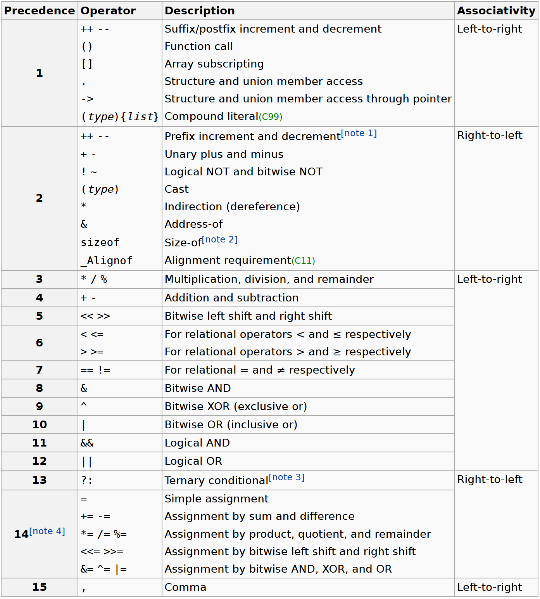

# Operatoren und Ausdrücke

[Zurück](../../Markdown/Agenda.md)

---

## Vorrang (Priorität) und Stelligkeitm (Assoziativität) von Operatoren

In der folgenden Tabelle sind die Rangfolge und Assoziativität von C&ndash;Operatoren aufgeführt.
Die Operatoren werden von oben nach unten in absteigender Reihenfolge aufgelistet.



*Tabelle* 1: Vorrang der C&ndash;Operatoren.

<sup>Entnommen aus [C Operator Precedence](https://en.cppreference.com/w/c/language/operator_precedence)</sup>

Zu den Begriffen:

  * *Stelligkeit*:<br />
    Der Begriff *Stelligkeit* steht für die Anzahl der Argumente eines Operators.
    Einstellige Operatoren benötigen nur einen Operanden.
    Beispiel ist etwa der Minus-Operator (`-`), um von einer Zahl (einer Variablen) den negativen Wert zu bestimmen.
    Zweistellige Operatoren benötigen zwei Operanden.
    Beispiele sind etwa die arithmetischen Operationen
    Addition, Subtraktion, Multiplikation, oder Division, oder die logischen Operationen
    &ldquo;Logisches Und&rdquo; (`&&`)  und
    &ldquo;Logisches Oder&rdquo; (`||`).

  * *Priorität* :<br />
    Zunächst einmal ganz einfach formuliert:
    Unter der *Priorität* von Operatoren versteht man die *Punkt- vor Strich*&ndash;Regel.
    Etwas allgemeiner und formaler ausgedrückt:
    Für jeden Operator wird eine *Priorität* festgelegt, indem jedem Operator ein *Rang* zugeordnet wird.
    Dieser Rang entscheidet das Gruppieren und die Auswertung von Operanden in arithmetischen Ausdrücken.
    Ausdrücke mit höherrangigen Operatoren werden zuerst ausgewertet.
    Diese (im englischen als *Operator-Precedence* bezeichnete) Rangordnung
    stellt die Assoziativität verschiedenartiger Operatoren aufgrund deren Priorität sicher.


### Assoziativität

Mit der *Priorität* von Operatoren beschreibt man die Reihenfolge in der Auswertung
von arithmetischen Ausdrücken mit unterschiedlichen Operatoren.
Was aber, wenn es sich um denselben Operator handelt
(oder um verschiedene Operatoren, aber mit gleichem Vorrang),
zum Beispiel

```cpp
int x = 1 - 2 - 3;
```

Besitzt `n` den Wert -4 oder 2? Okay, Sie werden vermutlich für den Wert -4 plädieren
auf Grund der Vorgehensweise: Ich lese den Ausdruck von &ldquo;links nach rechts&rdquo;.

Okay, wie sieht es mit diesem Code-Fragment aus?

```cpp
int a = 1;
int b = 2;
int c = 3;

int d;

d = c = b = a;
```

Dies ist schon eher eine subtile Form der Wertzuweisung:
Wir sprechen von einer so genannten *Mehrfachzuweisung*:
Sie wird von &ldquo;rechts nach links&rdquo; abgearbeitet,
also im vorliegenden Beispiel wird als erstes `b` der Wert von `a` zugewiesen
(also `1`), dieser Wert wird danach der Variablen `c` zugewiesen und schließlich der Variablen `d`.

Hieraus hat sich der Begriff der *Assoziativität* von Operatoren entwickelt:

  * *Assoziativität* :<br />
    Die Assoziativität gibt an, ob eine Folge von Operatoren gleichen Vorrangs von links oder von rechts abgearbeitet wird.

---

## Beispiele


*Beispiel*:

```c
01: static void testOperators_01()
02: {
03:     int n = 3 + 4 * 5;   // "Punkt-vor-Strich"    // 23
04: 
05:     int m = -1 + -2 + -3;                         //-6
06: 
07:     int k = 1 + 2 - 3 * 5 + 6 - 8 * 9;            //-78
08: 
09:     int l = 1 + (2 - 3) * (5 + 6) - 8 * 9;        //-82
10: }
11: 
12: static void testOperators_02()
13: {
14:     // Inkrement
15: 
16:     int n = 10;
17: 
18:     int m;
19: 
20:     m = ++n;  // Pre-Inkrement
21:     printf("m = %d\n", m);
22: 
23:     // versus
24: 
25:     m = n++;  // Post-Inkrement
26:     printf("m = %d\n", m);
27: 
28:     // ============================
29: 
30:     // Tipp
31: 
32:     ++n;
33:     m = n;  // Wertzuweisung
34:     printf("m = %d\n", m);
35: 
36:     // versus
37: 
38:     m = n;  // Wertzuweisung
39:     n++;
40:     printf("m = %d\n", m);
41: }
42: 
43: static void testOperators_03()
44: {
45:     // Wann ist eine ganze Zahl gerade oder ungerade ???
46: 
47:     int n = 10;
48: 
49:     // ....
50: 
51:     if ((n % 2) == 0) {
52: 
53:         printf("n ist gerade: %d\n", n);
54:     }
55: 
56:     n = 11;
57: 
58:     if ((n % 2) == 1) {
59: 
60:         printf("n ist ungerade: %d\n", n);
61:     }
62: }
```

---

## Quellcode des Beispiels:

[*Operators.c*](Operators.c)<br />

---

[Zurück](../../Markdown/Agenda.md)

---
