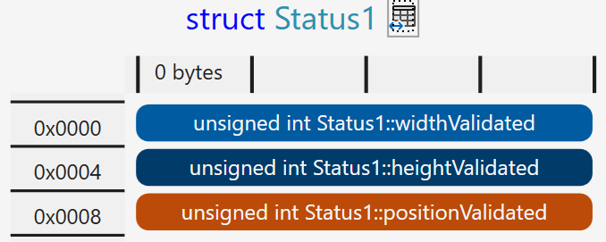
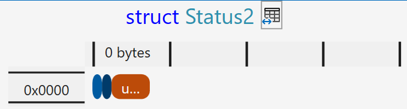
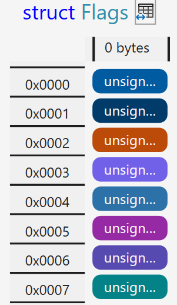
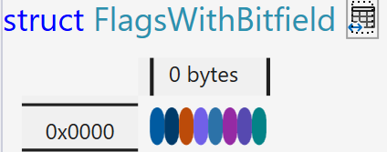
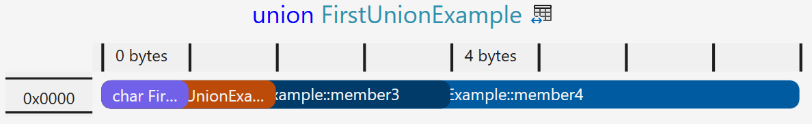

# Bitfelder, Unions und Enums

[Zurück](../../Markdown/Agenda.md)

---

## Allgemeines

Wir betrachten im Einzelnen:

  * Bitfelder
  * Unions
  * Schachtelung von Unions und Arrays
  * Die *Designated Initializer Syntax* für Unions und Felder
  * Enums (Aufzählungen)

---

## Beispiele zu Bitfeldern

*Beispiel*:

```c
01: struct Status1
02: {
03:     unsigned int widthValidated;
04:     unsigned int heightValidated;
05:     unsigned int positionValidated;
06: };
07: 
08: /* define same simple structure with bit fields */
09: struct Status2
10: {
11:     unsigned int widthValidated    : 1;
12:     unsigned int heightValidated   : 1;
13:     unsigned int positionValidated : 4;
14: };
```

*Ablage im Speicher*:

Struktur ohne Bitfeldnotation:


<br />

Struktur mit Bitfeldnotation:


<br />

*Ein zweites Beispiel*:


```c
01: struct Flags
02: {
03:     unsigned char flag_01;
04:     unsigned char flag_02;
05:     unsigned char flag_03;
06:     unsigned char flag_04;
07:     unsigned char flag_05;
08:     unsigned char flag_06;
09:     unsigned char flag_07;
10:     unsigned char flag_08;
11: };
12: 
13: struct FlagsWithBitfield
14: {
15:     unsigned char flag_01 : 1;
16:     unsigned char flag_02 : 1;
17:     unsigned char flag_03 : 1;
18:     unsigned char flag_04 : 1;
19:     unsigned char flag_05 : 1;
20:     unsigned char flag_06 : 1;
21:     unsigned char flag_07 : 1;
22:     unsigned char flag_08 : 1;
23: };
```

Struktur ohne Bitfeldnotation:


<br />

Struktur mit Bitfeldnotation:


<br />

---

## Beispiele zu Unions

*Beispiel*:

```c
01: union FirstUnionExample
02: {
03:     char   member1;
04:     short  member2;
05:     float  member3;
06:     double member4;
07: };
```

Ablage der Unionelemente im Speicher:


<br />

*Ein zweites Beispiel*:

Modellierung des RGB-Farbschemas mit einer `union`:


```c
01: union rgb
02: {
03:     unsigned int  color;
04:     unsigned char bytes_of_color[4];
05: };
06: 
07: typedef union rgb RGB;
08: 
09: static void unions_rgb()
10: {
11:     RGB red = { .color = 0x00FF0000 };
12: 
13:     printf("Red:     0x%0X\n", red.color);
14: 
15:     unsigned char a = red.bytes_of_color[3];
16:     unsigned char r = red.bytes_of_color[2];
17:     unsigned char g = red.bytes_of_color[1];
18:     unsigned char b = red.bytes_of_color[0];
19: 
20:     RGB magenta = 
21:     { 
22:         .bytes_of_color[3] = 0, 
23:         .bytes_of_color[2] = 255,
24:         .bytes_of_color[1] = 0,
25:         .bytes_of_color[0] = 255
26:     };
27: 
28:     printf("Magenta: 0x%0X\n", magenta.color);
29: 
30:     RGB yellow = { .color = 0x00FFFF00 };
31: 
32:     printf("Yellow:  Red=0x%02X - Green=0x%02X - Blue=0x%02X\n", 
33:         yellow.bytes_of_color[2],
34:         yellow.bytes_of_color[1],
35:         yellow.bytes_of_color[0]
36:     );
37: }
```

*Ausgabe*:

```
Red:     0xFF0000
Magenta: 0xFF00FF
Yellow:  Red=0xFF - Green=0xFF - Blue=0x00
```

*Ein drittes Beispiel*:

Modellierung einer IP-Adresse durch eine `union`:

```c
01: union ipAddress
02: {
03:     unsigned int  address;
04:     unsigned char octets[4];
05: };
06: 
07: typedef union ipAddress IPAddress;
08: 
09: void test_union()
10: {
11:     IPAddress localHost = {
12:         .octets[0] = 1,
13:         .octets[1] = 0,
14:         .octets[2] = 0,
15:         .octets[3] = 127
16:     };
17: 
18:     unsigned int localHostAddress = localHost.address;
19: 
20:     printf("Localhost: %u.%u.%u.%u\n",
21:         localHost.octets[3],
22:         localHost.octets[2],
23:         localHost.octets[1],
24:         localHost.octets[1]
25:     );
26: 
27:     printf("Localhost: %u - %X\n", localHostAddress, localHostAddress);
28: 
29:     IPAddress anotherIPAddress = {
30:         .octets[0] = 1,
31:         .octets[1] = 254,
32:         .octets[2] = 16,
33:         .octets[3] = 172
34:     };
35: 
36:     printf("Another IPAddress: %u.%u.%u.%u\n",
37:         anotherIPAddress.octets[3],
38:         anotherIPAddress.octets[2],
39:         anotherIPAddress.octets[1],
40:         anotherIPAddress.octets[0]
41:     );
42: 
43:     unsigned int address = anotherIPAddress.address;
44: 
45:     printf("Another IPAddress: %u - %X\n", address, address);
46: }
```

*Ausgabe*:

```
Localhost: 127.0.0.0
Localhost: 2130706433 - 7F000001
Another IPAddress: 172.16.254.1
Another IPAddress: 2886794753 - AC10FE01
```

---

## Beispiele zu Enums


*Beispiel*:


```c
01: enum level
02: {
03:     Low,
04:     Medium,
05:     High
06: };
07: 
08: typedef enum level Level;
09: 
10: void enums()
11: {
12:     Level level = Medium;
13: 
14:     switch (level)
15:     {
16:     case Low:
17:         printf("Low Level\n");
18:         break;
19:     case Medium:
20:         printf("Medium Level\n");
21:         break;
22:     case High:
23:         printf("High Level\n");
24:         break;
25:     }
26: 
27:     printf("Level: %d\n", level);
28: }
```


*Ausgabe*:

```
Medium Level
Level: 1
```

---

## Quellcode des Beispiels:

[*UnionsBitFieldsEnums.c*](UnionsBitFieldsEnums.c)<br />

---

[Zurück](../../Markdown/Agenda.md)

---
